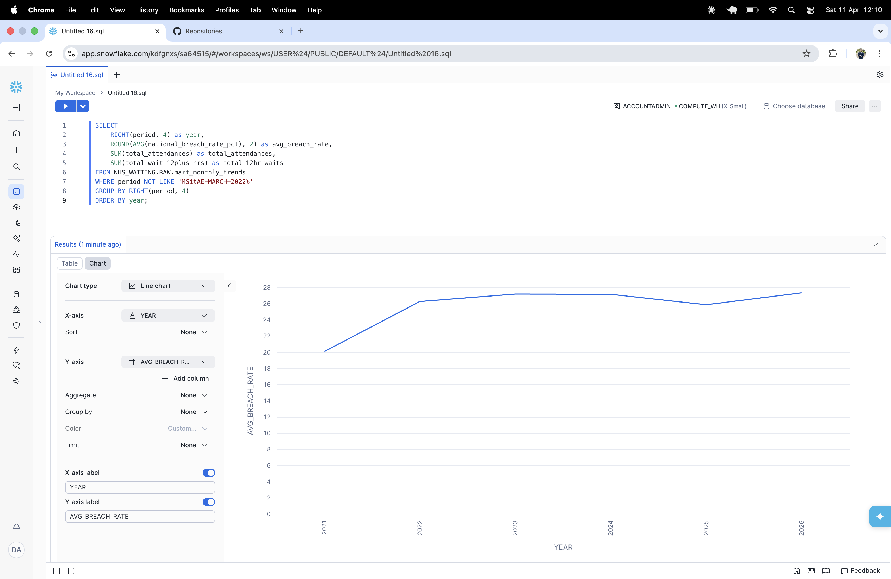
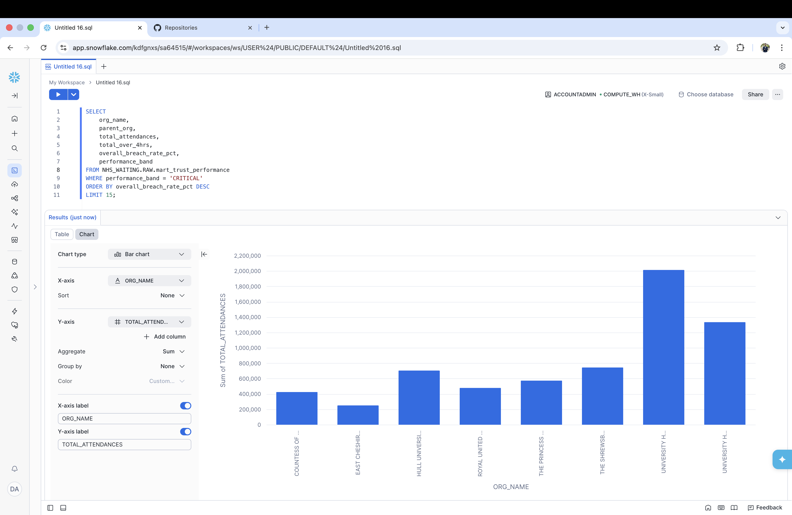
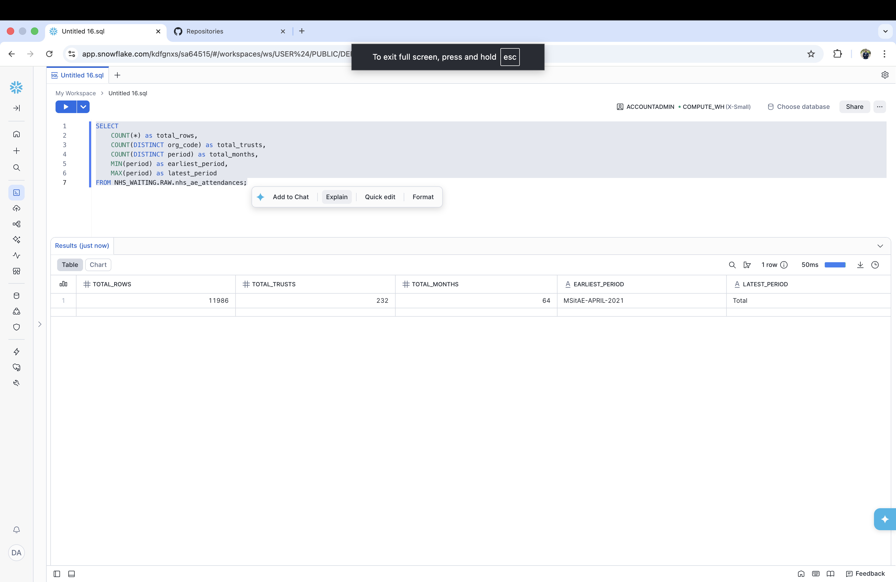

# NHS A&E Waiting List Pipeline

An end-to-end data engineering pipeline ingesting NHS England A&E attendance and waiting time data, transforming it with PySpark, loading into Snowflake, and modelling with dbt.

## Architecture

```
NHS England (CSV) → Python Extract → PySpark Transform → Snowflake → dbt Models → Airflow Orchestration
```

## Stack

| Layer | Technology |
|---|---|
| Ingestion | Python, BeautifulSoup, Requests |
| Transformation | PySpark |
| Warehouse | Snowflake |
| Modelling | dbt (Snowflake adapter) |
| Orchestration | Apache Airflow (Docker) |

## Dataset

- **Source:** NHS England A&E Attendances and Emergency Admissions
- **Coverage:** April 2021 – February 2026 (5 years)
- **Granularity:** Provider level (NHS Trusts and Foundation Trusts)
- **Rows:** 11,986 across 59 monthly files

## Insights


*National A&E breach rate rose from 20% in 2021 to over 27% by 2022 and has remained elevated — visible across 5 years of pipeline data.*


*Trusts classified as CRITICAL by the dbt mart_trust_performance model — breach rates consistently above 40%.*


*11,986 rows across 232 NHS trusts and 64 reporting periods ingested, transformed and loaded into Snowflake.*


## Pipeline

### Extract
Scrapes 5 years of NHS England statistics pages and downloads all monthly A&E CSV files programmatically. Skips files already downloaded to avoid duplication.

### Transform
PySpark job that loads all monthly CSVs into a single unified DataFrame, standardises column names to snake_case, removes null rows, and adds derived metrics including total attendances, total 4hr breaches, breach rate percentage, and total emergency admissions. Output saved as Parquet.

### Load
Loads processed Parquet data into Snowflake, creating the database and schema if they don't exist. Handles numpy type conversion and NaN to NULL mapping before insert.

## dbt Models

Three-layer structure following dbt best practices:

```
staging/
  stg_nhs_ae_attendances       cleaned source data

intermediate/
  int_nhs_ae_by_trust          aggregated metrics per trust across all months

marts/
  mart_trust_performance       trust performance with CRITICAL/HIGH/MEDIUM/LOW bands
  mart_monthly_trends          national A&E trends by month
```

9 data quality tests covering null checks, uniqueness, and accepted value validation.

## Orchestration

Airflow DAG scheduled monthly on the 1st of each month at 06:00 UTC:

```
extract → transform → load_to_snowflake → dbt_run → dbt_test
```

## Project Structure

```
nhs-waitinglist-pipeline/
├── etl/
│   ├── extract/extract.py
│   ├── transform/transform.py
│   └── load/load_to_snowflake.py
├── nhs_waiting_dbt/
│   └── models/
│       ├── staging/
│       ├── intermediate/
│       └── marts/
├── airflow/
│   └── dags/nhs_pipeline_dag.py
├── data/
│   ├── raw/
│   └── processed/
├── docker-compose.yml
└── requirements.txt
```

## Setup

### Prerequisites
- Python 3.11+
- Java 17 (for PySpark)
- Docker
- Snowflake account

### Install dependencies
```bash
pip3 install -r requirements.txt
```

### Environment variables
Create a `.env` file:
```
SNOWFLAKE_ACCOUNT=your_account
SNOWFLAKE_USER=your_user
SNOWFLAKE_PASSWORD=your_password
SNOWFLAKE_DATABASE=NHS_WAITING
SNOWFLAKE_SCHEMA=RAW
SNOWFLAKE_WAREHOUSE=COMPUTE_WH
SNOWFLAKE_ROLE=ACCOUNTADMIN
```

### Run the pipeline
```bash
python3 etl/extract/extract.py
python3 etl/transform/transform.py
python3 etl/load/load_to_snowflake.py
cd nhs_waiting_dbt && dbt run && dbt test
```

### Start Airflow
```bash
docker compose up airflow-init
docker compose up airflow-webserver airflow-scheduler -d
```

Visit http://localhost:8081 — login with admin/admin.

## Author
Daud Abdi · [github.com/Daudsaid](https://github.com/Daudsaid) · [daudabdi.com](https://daudabdi.com)